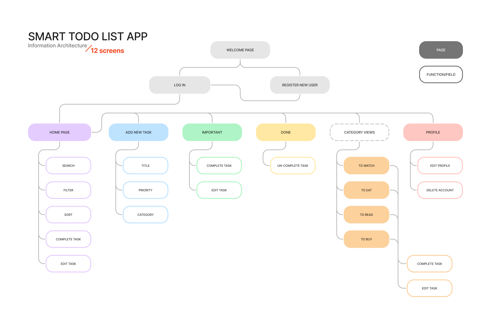

# Smart Todo List App Design Doc
## Table of Content
- [User Stories & Acceptance Criteria](#user-stories--acceptance-criteria)
- [Information Architecture](#information-architecture)
- [User Flow](#user-flow)
- [ERD](#erd)
- [Planned Routes](#planned-routes)
## User Stories & Acceptance Criteria
| User Story | Acceptance Criteria |
| --- | --- |
| **As a** new user, **I want to** sign up, **so that** I can use the app | criteria |
| **As a** logged-in user, **I want to** update my profile, **so that** I can update my username or password | criteria |
| **As a** logged-in user, **I want to** add a task, **so that** I can do it later AND the task auto-categorizes into four categories | criteria |
| **As a** logged-in user, **I want to** change the category of a task when it's mis-categorized, **so that** I can refer to it from the correct list | criteria |
| **As a** logged-in user, **I want to** set the priority of a task, **so that** I can check all my high-priority tasks in one place | criteria |

## Information Architecture

## User Flow
> TODO: insert user flow diagram
## ERD
> TODO: insert ERD
## Planned Routes
> TODO: insert routes and methods
