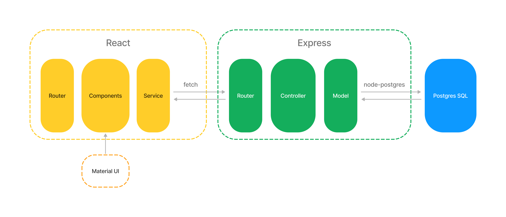

# Smart Todo List App Design Doc
## Table of Content
- [User Stories & Acceptance Criteria](#user-stories--acceptance-criteria)
- [Information Architecture](#information-architecture)
- [User Flow](#user-flow)
- [Wireframes](#wireframes)
- [Architecture](#architecture)
- [ERD](#erd)
- [Planned Routes](#planned-routes)

## User Stories & Acceptance Criteria
| User Story | Acceptance Criteria |
| --- | --- |
| **As a** new user, **I want to** sign up, **So that** I can use the app. | **Given that** I'm on the new user registration page, **When** I fill in my email, password and click the `Register` button, **Then** I can log in with these credentials and start using the app. |
| **As a** logged-in user, **I want to** update my profile, **So that** I can update my user info. | **Given that** I'm logged in and on the `Profile` page, **When** I change my user info and click the `Save` button, **Then** the updated info is shown in the app. |
| **As a** logged-in user, **I want to** add a task, **So that** I can refer to it later AND the app should suggest an appropriate category to label the task. | **Given that** I'm logged in and added text to a task, **When** I click the `Add` button, **Then** the task is added to the list with an auto-populated category label. |
| **As a** logged-in user, **I want to** change the category of a task when it's mis-categorized, **So that** I can refer to it from the correct list. | **Given that** I just added a task and a wrong label is assigned to it, **When** I click on the `label`, **Then** it should show me a dropdown with available options and allow me to choose another one. |
| **As a** logged-in user, **I want to** set the priority of a task, **So that** I can check all my high-priority tasks in one place. | **Given that** I have added tasks with priority = `high`, **When** I click on the `important` tab, **Then** it should show me all the high-priority tasks on the page. |
| **As a** logged-in user, **I want to** mark a task as complete, **So that** I can keep track of my to-dos. | **Given that** I have a to-do item, **When** I click on the checkbox at the beginning of the task, **Then** it should mark the task as complete with a line striked through the title and add the task to the `Done` page. |
| **As a** logged-in user, **I want to** view tasks per their category, **So that** I can better organize them. | **Given that** I have added tasks labeled with the available categories, **When** I click on category tab from the home page, **Then** it should show me all the tasks with that label on the page. |

## Information Architecture

## User Flow

## Wireframes 
### Welcome Page:

### Login Page:

### Register Page:

### Tasks Overview Page:

### Profile Page:

### Add a New Task:

## Architecture

## ERD

## Planned Routes
### React Page Routes
| Route              | Description
| ---                | ---                      |
| `/`                | Home page                |
| `/register`        | Registration page        |
| `/login`           | Log in page              |
| `/profile/:userId` | User profile page        |
| `/tasks`           | Tasks overview page      |
| `/tasks/:labelId`  | Tasks by label pages     |
| `/tasks/done`      | Completed tasks page     |
| `/tasks/high`      | High priority tasks page |

### Express API Endpoints
| Route                         | Method   | Description               |
| ---                           | ---      | ---                       |
| `/api/users/:userId`          | `GET`    | Get user by id            |
| `/api/users/:userId`          | `PUT`    | Update user info by id    |
| `/api/tasks`                  | `GET`    | Get all tasks             |
| `/api/tasks?label=<labelId>`  | `GET`    | Get all tasks by label id |
| `/api/tasks?priority=<priorityId>` | `GET`    | Get all tasks by priority id |
| `/api/tasks?is_complete=<boolean>` | `GET`    | Get all tasks by completion status |
| `/api/tasks`                  | `POST`   | Create new task           |
| `/api/tasks/:taskId`          | `GET`    | Get task by id            |
| `/api/tasks/:taskId`          | `PUT`    | Update task info by id    |
| `/api/tasks/:taskId`          | `DELETE` | Delete task by id         |
